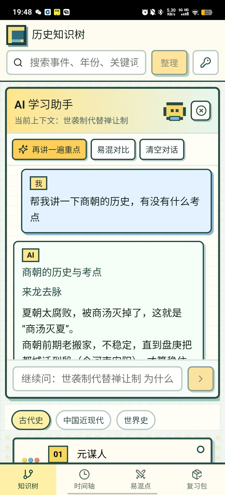

# 📖 历史知识树

> 面向初中历史复习的知识树应用 —— 把时间、事件和影响串起来。

[https://github.com/Indigo-gg/history-tree](https://github.com/Indigo-gg/history-tree)

## 📺 演示视频

https://github.com/Indigo-gg/history-tree/releases/download/v0.1.0/introduce.mp4

> 视频也可在 [Releases 页面](https://github.com/Indigo-gg/history-tree/releases) 下载。

## 📸 页面展示



上图展示了“历史主线”页面，左侧为各个历史事件的节点卡片，右侧为节点间的逻辑关系图谱。点击特定节点，右侧还会弹出带有 AI 助手和复习标记功能的侧边栏。

## ✨ 功能特性

### 🌲 知识树视图

- 基于 React Flow 的**可交互知识图谱**，可缩放、拖拽、导航
- 按**古代史 / 中国近现代 / 世界史**三大板块分类浏览
- 节点间自动展示**时间线、因果、影响、对比、包含**等关系连线
- **故事线模式**：按历史主线串联事件，每个节点附带一句话记忆提示

### ⏳ 时间轴

- 所有知识点按**时间先后自动排序**
- 从远古传说到当代，支持公元前纪年、世纪、年代等多种时间格式

### ⚔️ 易混点辨析

- 内置**易混知识点对比表**，多维度拆解混淆原因
- 附带记忆口诀和常见错误提示

### 📦 复习包

- 一键标记知识点为**已掌握 / 易混 / 待复习**
- 复习包自动聚合所有待复习内容，有针对性地查缺补漏

### 🤖 AI 学习助手

- 接入阿里云百炼（通义千问），支持**流式对话**
- 针对每个知识点自动生成「来龙去脉 → 重点信息 → 为什么重要 → 易混点 → 记忆技巧」讲解
- 支持自由追问，对话上下文自动保存在浏览器本地
- **AI 搜索整理**：输入关键词，AI 自动串联相关知识点形成专题总结

### 📱 多端支持

- **PWA**：支持添加到桌面，离线可用
- **Android**：基于 Capacitor 打包为原生 APK

## 🛠️ 技术栈

| 层级     | 技术                                        |
| -------- | ------------------------------------------- |
| 框架     | React 19 + TypeScript                       |
| 构建     | Vite 7                                      |
| 知识图谱 | @xyflow/react (React Flow)                  |
| 图标     | Lucide React                                |
| AI       | 阿里云百炼 (DashScope) 兼容接口 · 通义千问 |
| 移动端   | Capacitor 8 (Android)                       |
| 数据存储 | LocalStorage（学习状态 & AI 对话）          |

## 📁 项目结构

```
history-learn/
├── src/
│   ├── App.tsx          # 主应用（知识树/时间轴/易混点/复习/AI助手）
│   ├── ai.ts            # AI 对话与搜索整理逻辑
│   ├── storage.ts       # 本地存储（学习状态、API Key、AI对话）
│   ├── types.ts         # 类型定义（知识卡片、关系、易混对、学习状态）
│   ├── styles.css       # 全局样式
│   └── main.tsx         # 入口
├── data/
│   ├── app/             # 结构化知识数据（JSON）
│   │   ├── history-cards.*.json    # 知识卡片
│   │   ├── history-edges.*.json    # 关系连线
│   │   └── confusions.*.json       # 易混对比
│   └── source/          # PDF 提取的参考原始数据
├── scripts/             # 数据处理脚本
├── android/             # Capacitor Android 工程
├── public/              # PWA 资源（manifest、Service Worker、图标）
└── docs/                # 设计文档
```

## 🚀 快速开始

### 环境要求

- **Node.js** ≥ 18
- **npm** ≥ 9

### 安装与运行

```bash
# 克隆仓库
git clone https://github.com/Indigo-gg/history-tree.git
cd history-tree

# 安装依赖
npm install

# 启动开发服务器
npm run dev
```

浏览器打开 `http://127.0.0.1:5173` 即可使用。

### AI 功能配置

1. 注册 [阿里云百炼](https://bailian.console.aliyun.com/) 并获取 API Key
2. 在应用右上角点击 🔑 图标，输入 API Key
3. API Key 仅保存在浏览器本地，不会上传到任何服务器

### Android 打包

```bash
# 同步 Web 资源并打包 Debug APK
npm run android:apk

# 打包 Release APK（需要配置签名）
npm run android:release
```

## 📊 知识库规模

| 数据集       | 数量                                 |
| ------------ | ------------------------------------ |
| 知识卡片     | 覆盖古代史、近现代史、世界史五大板块 |
| 关系连线     | 时间线 / 因果 / 影响 / 对比 / 包含   |
| 易混对比     | 涵盖各板块高频混淆知识点             |
| PDF 候选节点 | 588 个（待人工校对扩充）             |

## 📜 许可证

本项目仅供学习交流使用。
